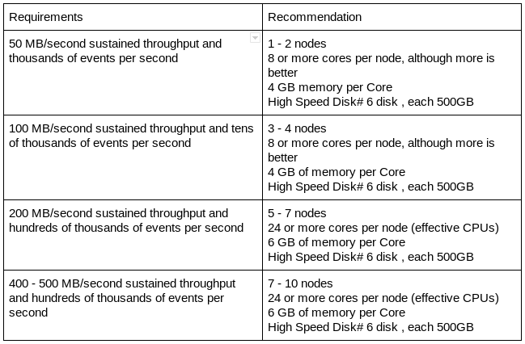

# Deployment Best Practices

## Configuration best practices for production

  - Increase the number of TCP socket ports available. This is particularly important if the flow will be setting up and tearing down a large number of sockets in small period of time.

           sudo sysctl -w net.ipv4.ip_local_port_range="10000 65000"

  - Tell Linux you never want NiFi to swap. Swapping is fantastic for some applications. It is not good for something like NiFi, that always wants to be running.

To set swapping off, edit `/etc/sysctl.conf` to add the following line:

           vm.swappiness = 0

For the partitions handling the various NiFi repos, turn off things like `atime`. Doing so can cause a surprising bump in throughput. Edit the `/etc/fstab` file and for the partition(s) of interest add the `noatime` option.

## Hardware sizing recommendations

Following is the recommended hardware for NiFi production installation:

_Figure 1. - Hardware sizing recommendations_

## Block device/storage

### Disk recommendations

DC/OS Apache NiFi performs best when using disks with fast read and write patterns.

We recommend the following:

 1. Always prefer locally-attached storage. Remote storage adds points of failure, add latency/overhead to block requests, and is more complicated to troubleshoot.  
 2. For better performance, use solid-state disks rather than spinning disks. Spinning disks allocate more memory to cache more data, thereby reducing the processing memory available.
