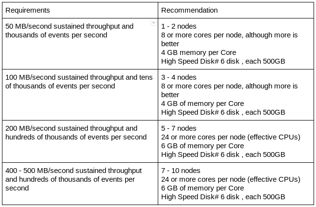

# Deployment Best Practices

## Configuration Best Practices for Production

- Increase the number of TCP socket ports available. This is particularly important if the flow will be setting up and tearing down a large number of sockets in a short time.

```shell
sudo sysctl -w net.ipv4.ip_local_port_range="10000 65000"
```

- Tell Linux you never want NiFi to swap. Swapping is fantastic for some applications. It is not good for something like NiFi that always wants to be running.

To set swapping off you can edit `/etc/sysctl.conf` to add the following line

```shell
vm.swappiness = 0
```

For the partitions handling the various NiFi repos turn off things like `atime`. Doing so can cause a surprising bump in throughput. Edit the `/etc/fstab` file and for the partition(s) of interest add the `noatime` option.

## Hardware Sizing Recommendations

Following is the recommnded hardware for NiFi roduction installation:

[](../service/HardwareRecommendation.png)

## Block Device / Storage

### Disk Recommendations

Apache NiFi performs best when using disks with fast read and write patterns.

We recommend the following:

1. Always prefer locally-attached storage. Remote storage adds points of failure, add latency/overhead to block requests and are more complicated to troubleshoot.  
2. For better performance, use Solid-State Disks vs. Spinning disks or allocate more memory to cache more data, reducing the use of disks.
