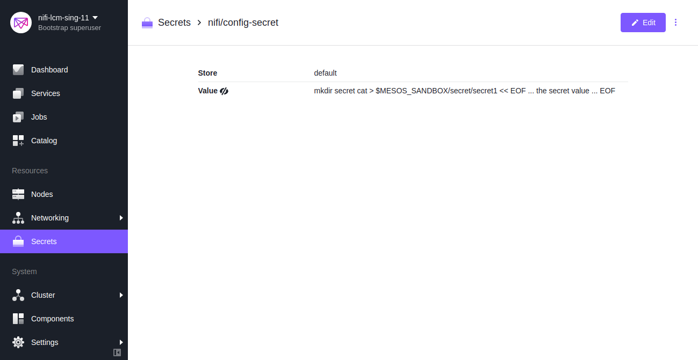
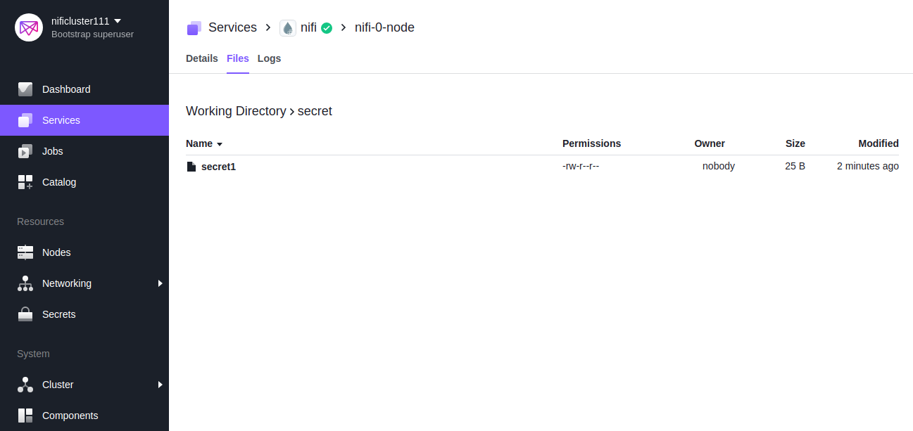
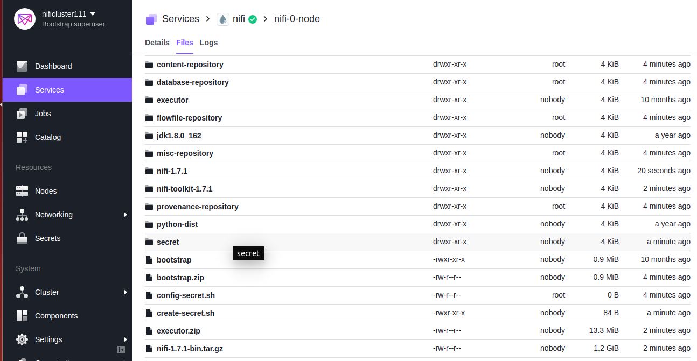
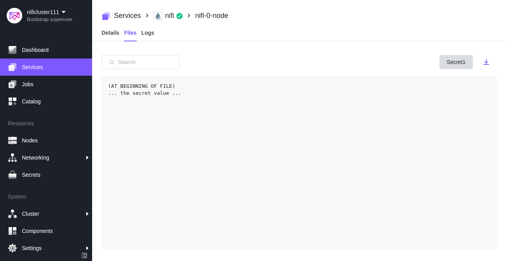

# DC/OS Apache NiFi Secret upload

The DC/OS Apache NiFi service supports NiFi’s Secret upload. The service provides to upload secrets file in all nodes of NiFi inside any existing folder or by creating a new folder.

## Secret upload
To upload secret file in nifi node, create a secret with id as nifi/<secret name> in the DC/OS Secret Store. The value of the secret should be in shell scripting for example, if secret file need to be inside a folder named secret, so first write the command to create a directory name secret and then use cat command to create the secret file, after that use << EOF to give the value of the secret file. Enable the secrets and give the name of secret that was created in the Secret Store. 

```shell
mkdir secret
cat > $MESOS_SANDBOX/secret/secret1 << EOF
... the secret value ...
EOF
```

[](../service/secret_value.png)

_Figure 1. - secret value_

## Prerequisites
- [A secret with id as nifi/<secret name> stored in the DC/OS Secret Store.](https://docs.mesosphere.com/1.12/security/ent/secrets/create-secrets/)

[](../service/secret_folder_content.png)

_Figure 2. - secret in the secret store_

### Install the Service
Install the DC/OS Apache NiFi service with the following options in addition to your own:

 ```shell
  {
  "service": {
    "name": "nifi"
  },
  "secrets": {
    "enable": true,
    "value": "secret"
  }
}
 ```

[](../service/node_content.png)

_Figure 3. - files in the nifi node_


[](../service/secret_content.png)

_Figure 4. - content of the secret_

