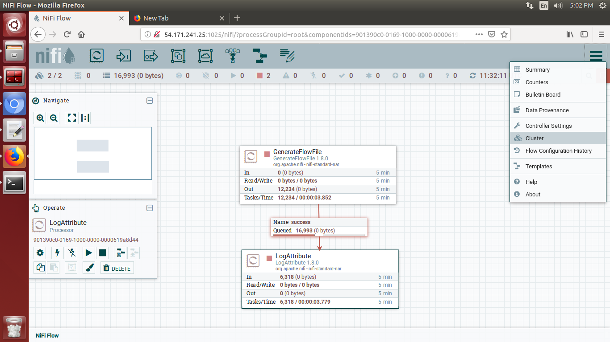
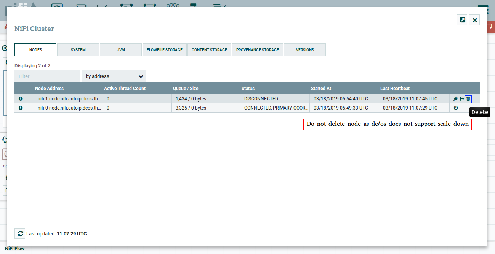

The DC/OS {{model.techName }} service supports offload node feature of {{model.techName }}. 

## Steps
Following are the steps for offloading node:

1. Go to `Cluster`

   

2. `Disconnect` node you want to offload
   
   

3. Select `Offload`

   

   

<strong>IMPORTANT: </strong> It is not recommended to use offload feature as Mesosphere does not support scale down. So after offloading if you delete the node, it is not going to remove from the cluster. Although if you see cluster view in NiFi UI it will not show up but it still runs and consumes resources.

  
