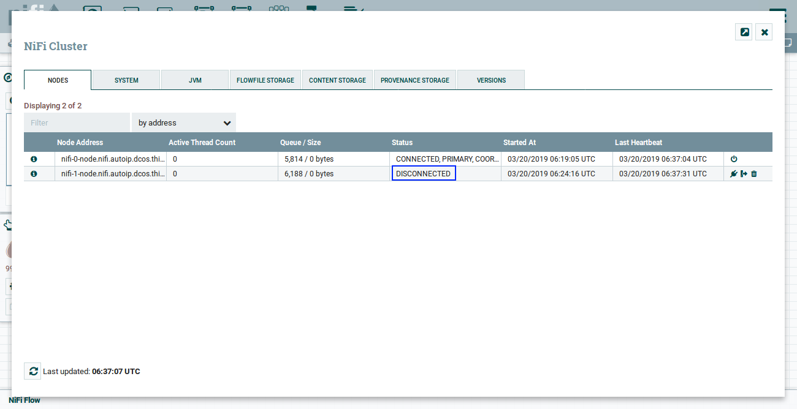
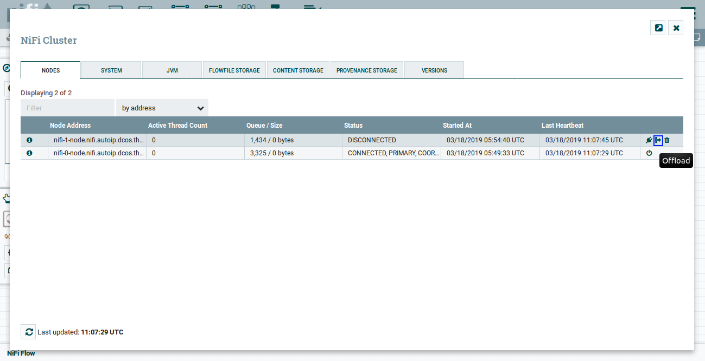
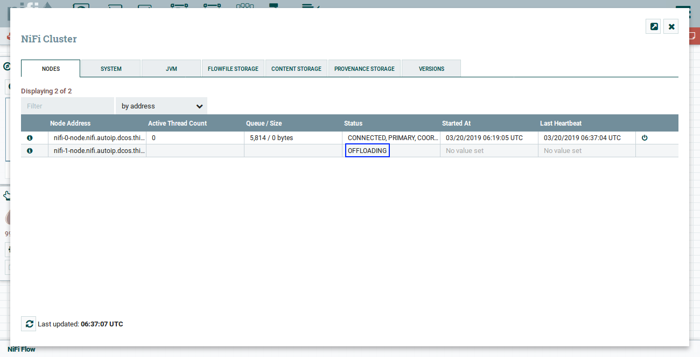
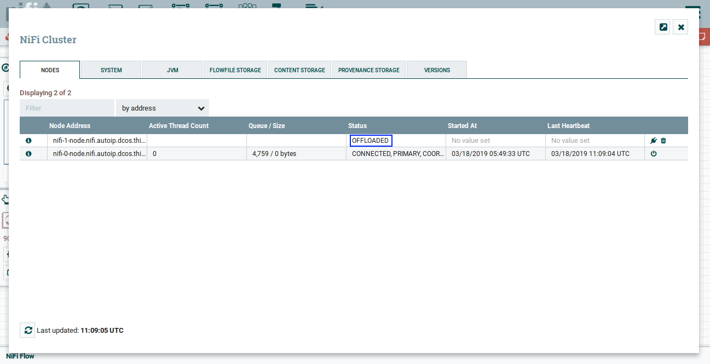
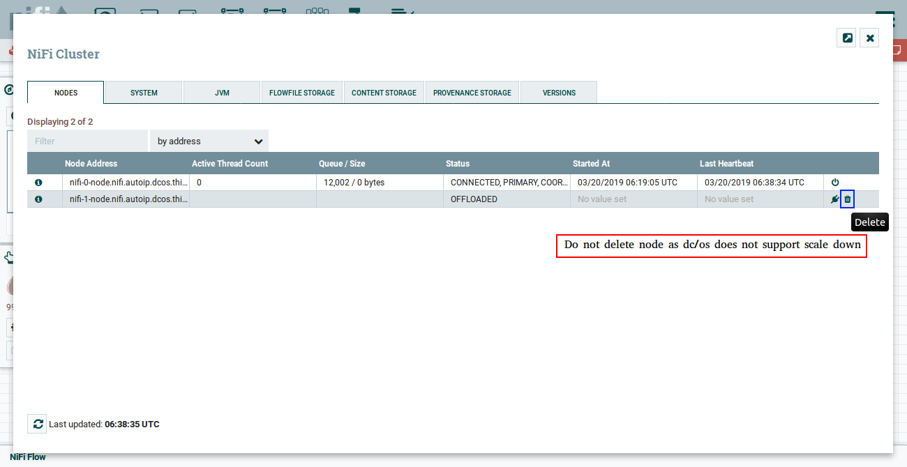

The DC/OS {{model.techName }} service supports offload node feature of {{model.techName }}. 

## Steps

<strong>IMPORTANT: </strong> It is not recommended to use offload feature as Mesosphere does not support scale down. So after offloading if you delete the node, it is not going to remove from the cluster. Although if you see cluster view in NiFi UI it will not shown but it still runs and consumes resources of your dc/os.

Following are the steps for offloading node:

1. Go to `Cluster`

   

   Figure 1. - cluster option in NiFi UI
      

   

   Figure 2. - cluster view in NiFi UI
      
   

2. `Disconnect` node you want to offload
   
   
   
   Figure 3. - disconnect node through NiFi UI
      
   

   

   Figure 4. - disconnect node confirmation NiFi UI
      
   

   

   Figure 5. - disconnected node in NiFi UI
      

3. Select `Offload`

   

   Figure 6. - offload node in NiFi UI
      
   

   

   Figure 7. offload node cofirmation in NiFi UI
      
   

   

   Figure 8. offloading node in NiFi UI
      
   

   

   Figure 9. offloaded node in NiFi UI
      

4. Delete `offloaded` node

   

   Figure 10. - delete offloaded node option in NiFi UI
      
   

   

   Figure 11. - delete offloaded node option in NiFi UI
      

