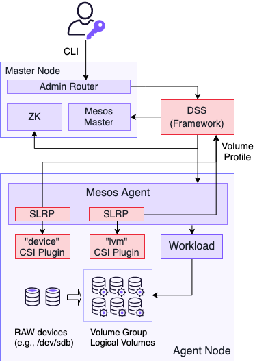

The following figure shows the high-level architecture of the storage support in DC/OS.

Figure 1. - Diagram of storage support architecture

One of the most important components in this architecture is the DC/OS Storage Service (DSS), a [service](/latest/overview/concepts/#system-service) that manages volumes, volume profiles, volume providers, and storage devices in the cluster.
DSS serves as the brain of the storage support system by collecting storage-related information from various components in the cluster, keeping track of their states, and acting on user requests.

Volumes are modeled as [Mesos resources](http://mesos.apache.org/documentation/latest/attributes-resources/#resources) ("disk" resources) so that all the resource management features (such as quota, fair sharing, and weights) from Mesos apply to volumes.
DSS itself is a Mesos framework that registers with the Mesos master, and manages "disk" resources offered from Mesos.

Devices from each agent are reported to DSS as [Mesos RAW disk resources](http://mesos.apache.org/documentation/latest/csi/#new-disk-source-types).
These devices can be used to create `lvm` volume providers.
Currently, there is a 1:1 mapping between volume providers and [Mesos Storage Local Resource Providers (SLRP)](http://mesos.apache.org/documentation/latest/csi/#storage-local-resource-provider).
Creating a volume provider effectively means creating an SLRP.
To create a volume provider, DSS will ask the Mesos agent operator API to create a SLRP.

Each SLRP is associated with a [CSI plugin](http://mesos.apache.org/documentation/latest/csi/#slrp-configuration) that is responsible for communicating with the actual storage backend.
Each CSI plugin is a set of long-running gRPC services. The gRPC service lifecycles are then managed by the corresponding SLRP.
More details can be found [here](http://mesos.apache.org/documentation/latest/csi/#standalone-containers-for-csi-plugins).

DSS is also responsible for creating volumes by [converting](http://mesos.apache.org/documentation/latest/csi/#new-offer-operations-for-disk-resources) Mesos [RAW disk resources](http://mesos.apache.org/documentation/latest/csi/#new-disk-source-types) to either [MOUNT or BLOCK disk resources](http://mesos.apache.org/documentation/latest/csi/#new-disk-source-types), and deleting volumes by doing the reverse.
Created MOUNT or BLOCK disk resources will be offered to other frameworks in the cluster.
These frameworks can then use the disk resources in the same way as they would use other MOUNT or BLOCK disk resources.

Cluster administrators can use DC/OS CLI to interact with DC/OS Storage Service (DSS) using the newly introduced 'storage' CLI subcommand.
See more details in the [CLI References](../cli-references/) section.
